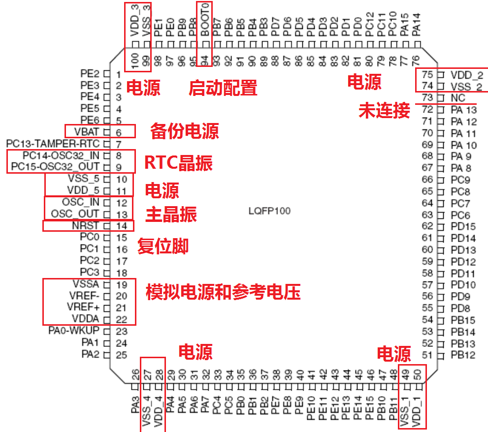
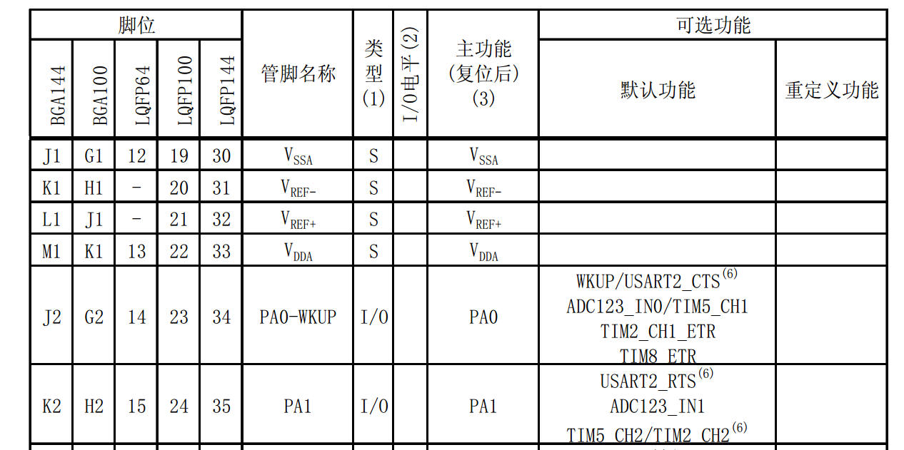
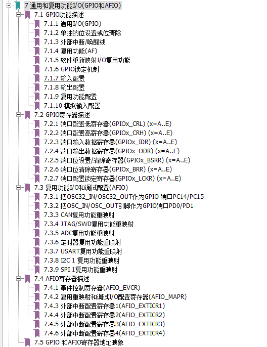
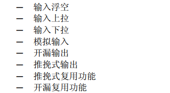
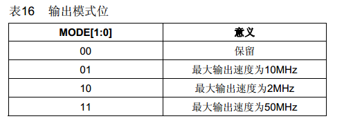
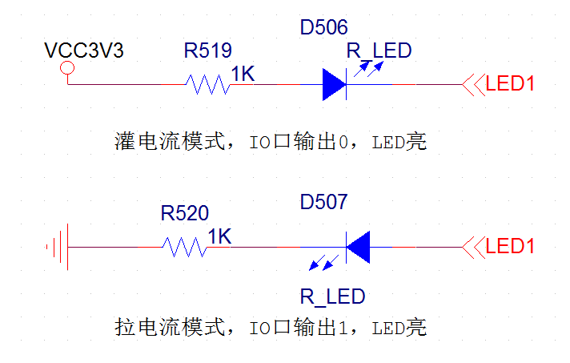

# IO&点亮LED

### 概述

芯片如何控制外部电路？

从本课开始，让我们一点一点把单片机系统的知识框架搭建起来。

本课，学习最简单的、也是最基本的：GPIO口。

本课讲以下几个问题：

1. IO是什么？GPIO是什么？
2. STM32的IO有什么特点？
3. LED如何使用？
4. 编码和调试过程（这段看视频更好）

### IO 是什么？

IO是Input&Output，也就是输入和输出。

我们选的STM32F103VET6这款芯片的，管脚总共有100根。

但是《STM32F103数据手册.pdf》中有写：IO口只有80，为什么？


在数据手册的第14页有管脚定义图，如下：



从管脚名称看到，P前缀的的管脚， 就是IO口。100脚的STM32，有PA、PB、PC、PD、PE，一共5组IO。

除了IO，还有电源和地、晶振输入、BOOT配置等其他功能的管脚。

> 1. 普通电源有5组。
> 2. 模拟电源有1组。
> 3. 备份电源一组。
> 4. 参考电压VREF有一组。
> 5. 复位脚和启动配置BOOT0各一根管脚。
> 6. 晶振两组，其中RTC晶振可做普通IO使用。
> 7. 73脚是空的，没有连接。

有些朋友可能有疑问，怎么都没看到SPI、I2C等功能的管脚？

通常IO口都能复用作其他功能，比如SPI、I2C等。在数据手册的管脚定义中有几页说明管脚可以复用做什么功能。

比如：



> PA0，主功能是PA0，可用作串口的CTS、ADC、TIM6、TIM2、TIM8等功能。
>

从此可见，我们说IO功能，通常只是一个IO口的基本功能：**GPIO**， 通用输入输出的意思。

#### GPIO功能

GPIO能用来做什么呢？

要理解这个GPIO，先要定下一个概念：**除了DA转换和AD转换， 其他的IO口都是数字逻辑功能**。

对GPIO来说，功能很简单，分两个：

1. 输出-在管脚上输出数字逻辑电平。
2. 输入-检测管脚的逻辑电平

> 芯片用的是TTL电平：
>
> 数字电平有两种，高电平和低电平。
>
> 高电平是逻辑1，低电平是逻辑0.
>
> 高电平是芯片的IO电压，STM32没有独立IO电压，IO电压就是是芯片工作电压，低电平是就地电平。
>
> *实际上呢，高电平和低电平是有一个范围的，并不仅仅是3.3V和0V*

#### GPIO驱动能力

一个IO口输出电流或输入电流的能力。

在中文版数据手册 第31页中，有下面这个表格：


> 灌电流和拉电流都是25mA
>
> 在设计外围电路时，电流不能超过这个值，否则会烧芯片。比如大电流的LCD背光，就需要在外部添加三极管驱动电路。
>
> 还有一个需要注意的，有些芯片，灌电流和拉电流的最大值不一样，灌电流可能只有5ma。

### STM32 IO特点

以前的单片机，比如8051，GPIO口非常简单，只要设置GPIO口的方向是输出还是输入，就可以工作了。用起来虽然简单，却无法满足各种应用场景。因此，高级的芯片，IO口通常有很多功能可以配置。

STM32的GPIO就是这样，如果操作寄存器操作的话，相当复杂。在《STM32F10x微控制器参考手册.pdf》中，第七章就是讲GPIO功能的。



* 首先要知道，IO口有8种模式：



> 其中GPIO用到的有5种。模拟输入是AD转换使用。推挽复用和开漏复用模式用于GPIO外的其他外设功能，比如SPI。
>
> **GPIO五种模式，要区分输入和输出：浮空、上拉、下拉，都是说输入。推挽、开漏，是输出。**

驱动LED用输出功能。那选推挽还是开漏模式呢？要先搞清楚推挽和开漏输出的区别。

|                | 推挽   | 开漏                                           |
| -------------- | ------ | ---------------------------------------------- |
| 高电平驱动能力 | 强     | 外部上拉电阻提供                               |
| 低电平驱动能力 | 强     | 强                                             |
| 电平转换速度   | 快     | 外部上拉电阻决定，电阻越小，反应越快，功耗越大 |
| 线与功能       | 不支持 | 支持                                           |
| 电平转换       | 不支持 | 支持                                           |

> 1. 开漏模式，IO口内部没有上拉电阻，没有接MOS管，所以开漏电路不能输出高电平；要输出高电平，需要外部接上拉电阻，如果外部上拉电阻接的电压不是芯片IO电压，就相当于实现了IO口电平转换功能。
>
>    比如，推挽模式下，IO口输出高电平就是3.3V，用开漏模式，外部接电阻上拉到5V，那么输出高电平就是5V。
>
> 2. 电平转换速度指芯片0/1翻转的速度。
>
> 3. 线与，两根IO直接连接在一起，电平按照与逻辑。通常用在一些可挂载多设备的总线上，比如I2C。
>
> 原理参考：<https://www.cnblogs.com/lweleven/p/mcuioout.html>

因此，驱动LED用推挽还是开漏？**除了必须用开漏的场合，我们都习惯用推挽输出**

* 第二，SMT32的IO有IO速度需要配置。



如果不知道如何选，全部用50M，功能肯定正常。但是可能会增加电流，增加EMC辐射。

经验：

> 普通功能的IO，通常2M就可以了。
>
> 如果一个IO用作I2C通信，速度通常就10K到400K，选10M就好了。
>
> 如果是用作SPI功能，可能会到20M速度，那就要选50M了。

到此，我们基本了解了STM32 GPIO的功能。下面看看ST的库都提供了什么函数给我们用。

### ST库函数

打开上一节我们创建的工程。在库函数中找到stm32f10x_gpio.c和stm32f10x_gpio.h

函数有下面这些：

```c
void GPIO_DeInit(GPIO_TypeDef* GPIOx);
void GPIO_AFIODeInit(void);
void GPIO_Init(GPIO_TypeDef* GPIOx, GPIO_InitTypeDef* GPIO_InitStruct);
void GPIO_StructInit(GPIO_InitTypeDef* GPIO_InitStruct);
uint8_t GPIO_ReadInputDataBit(GPIO_TypeDef* GPIOx, uint16_t GPIO_Pin);
uint16_t GPIO_ReadInputData(GPIO_TypeDef* GPIOx);
uint8_t GPIO_ReadOutputDataBit(GPIO_TypeDef* GPIOx, uint16_t GPIO_Pin);
uint16_t GPIO_ReadOutputData(GPIO_TypeDef* GPIOx);
void GPIO_SetBits(GPIO_TypeDef* GPIOx, uint16_t GPIO_Pin);
void GPIO_ResetBits(GPIO_TypeDef* GPIOx, uint16_t GPIO_Pin);
void GPIO_WriteBit(GPIO_TypeDef* GPIOx, uint16_t GPIO_Pin, BitAction BitVal);
void GPIO_Write(GPIO_TypeDef* GPIOx, uint16_t PortVal);
void GPIO_PinLockConfig(GPIO_TypeDef* GPIOx, uint16_t GPIO_Pin);
void GPIO_EventOutputConfig(uint8_t GPIO_PortSource, uint8_t GPIO_PinSource);
void GPIO_EventOutputCmd(FunctionalState NewState);
void GPIO_PinRemapConfig(uint32_t GPIO_Remap, FunctionalState NewState);
void GPIO_EXTILineConfig(uint8_t GPIO_PortSource, uint8_t GPIO_PinSource);
void GPIO_ETH_MediaInterfaceConfig(uint32_t GPIO_ETH_MediaInterface);
```

> GPIO_Init：初始化IO口，
>
> GPIO_SetBits：IO口输出1
>
> GPIO_ResetBits：IO口输出0
>
> GPIO_WriteBit：IO口输出状态，相当于GPIO_SetBits和GPIO_ResetBits组合。
>
> GPIO_Write：输出IO口状态。
>
> GPIO_WriteBit是在指定的IO口上输出**相同**的状态，GPIO_Write是在一组IO上输出需要的状态，。

我们看参数：

```
GPIO_SetBits(GPIO_TypeDef* GPIOx, uint16_t GPIO_Pin);
```

 将GPIOx这组IO口中，GPIO_Pin指定的IO口，输出高电平。

GPIO_ResetBits功能和GPIO_SetBits相反。

```
GPIO_WriteBit(GPIO_TypeDef* GPIOx, uint16_t GPIO_Pin, BitAction BitVal);
```

将GPIOx这组IO口中GPIO_Pin指定的IO口设置为BitVal的状态。

```
GPIO_Write(GPIO_TypeDef* GPIOx, uint16_t PortVal);
```

将GPIOx这组IO口设置为PortVal的状态。**注意，是一次设置一组IO**。

我们在来看看初始化的接口

```
void GPIO_Init(GPIO_TypeDef* GPIOx, GPIO_InitTypeDef* GPIO_InitStruct)
```

关键是第二个参数，这是一个结构体，定义如下：

```
typedef struct
{
  uint16_t GPIO_Pin;             /*!< Specifies the GPIO pins to be configured.
                                      This parameter can be any value of @ref GPIO_pins_define */

  GPIOSpeed_TypeDef GPIO_Speed;  /*!< Specifies the speed for the selected pins.
                                      This parameter can be a value of @ref GPIOSpeed_TypeDef */

  GPIOMode_TypeDef GPIO_Mode;    /*!< Specifies the operating mode for the selected pins.
                                      This parameter can be a value of @ref GPIOMode_TypeDef */
}GPIO_InitTypeDef;
```

> 第1个参数GPIO_Pin指定要配置的IO口。
>
> 第2个参数GPIO_Speed配置IO口速度。
>
> 第3个参数GPIO_Mode配置IO口模式。

其中GPIO_Speed和GPIO_Mode类型是**枚举**，如下：

* 速度

```
typedef enum
{ 
  GPIO_Speed_10MHz = 1,
  GPIO_Speed_2MHz, 
  GPIO_Speed_50MHz
}GPIOSpeed_TypeDef;
```

* 模式

```
typedef enum
{ GPIO_Mode_AIN = 0x0,
  GPIO_Mode_IN_FLOATING = 0x04,
  GPIO_Mode_IPD = 0x28,
  GPIO_Mode_IPU = 0x48,
  GPIO_Mode_Out_OD = 0x14,
  GPIO_Mode_Out_PP = 0x10,
  GPIO_Mode_AF_OD = 0x1C,
  GPIO_Mode_AF_PP = 0x18
}GPIOMode_TypeDef;
```

配置IO的时候，选用这里的定义即可。

我们看下例程，在目录`STM32F10x_StdPeriph_Lib_V3.5.0\Project\STM32F10x_StdPeriph_Examples\GPIO\IOToggle`

中的main函数，初始化IO口的代码如下：

```c
int main(void)
{
  /*!< At this stage the microcontroller clock setting is already configured, 
       this is done through SystemInit() function which is called from startup
       file (startup_stm32f10x_xx.s) before to branch to application main.
       To reconfigure the default setting of SystemInit() function, refer to
       system_stm32f10x.c file
     */     
       
  /* GPIOD Periph clock enable */
  RCC_APB2PeriphClockCmd(RCC_APB2Periph_GPIOD, ENABLE);

  /* Configure PD0 and PD2 in output pushpull mode */
  GPIO_InitStructure.GPIO_Pin = GPIO_Pin_0 | GPIO_Pin_2;
  GPIO_InitStructure.GPIO_Speed = GPIO_Speed_50MHz;
  GPIO_InitStructure.GPIO_Mode = GPIO_Mode_Out_PP;
  GPIO_Init(GPIOD, &GPIO_InitStructure);
```

> 1.  调用RCC_APB2PeriphClockCmd函数打开GPIOD时钟。
>
> 这个是需要注意的，ST的芯片每个设备都有时钟，使用之前都需要打开。
>
> 2. GPIO_Pin设置为GPIO_Pin_0 | GPIO_Pin_2， 说明过一次配置两个IO口。
> 3. 速度配置为GPIO_Speed_50MHz， 也就是50M
> 4. GPIO_Mode设置为GPIO_Mode_Out_PP， 也就是输出推挽模式。
> 5. 调用函数GPIO_Init进行配置。

### 如何使用LED

LED是什么？

> 发光二极管简称为LED。因化学性质又分有机发光二极管OLED和无机发光二极管LED。
>
> 它本质上是一个二极管，所以就有正负极。
>
> 加上电压就会亮，但是LED其实是一个电流器件，有电流了才会亮。
>
> 电流越大，亮度越大，但是不能超过规格。

在资料文件夹内有一个发光二极管的规格书。LED的规格书中有一个很重要的参数。 《黄绿 0603 (33_40mcd)_PDF_C2289_2015-07-23.pdf》


第1行，顺向电流，就是LED的工作电流，不能超过20mA。

LED驱动有两种方式：低电平（灌电流）和高电平（拉电流），如下图



我们的板子选用灌电流模式，4位LED电路原理图如下：


LED正极通过一个限流电阻接到VCC3V3，也就是高电平。负极接到IO口。

当IO口输出低电平，电流从电阻流过，流过LED，流入IO口。LED就会发光。

限流电阻是防止流过LED的电流大于LED的**顺向电流**最大值。

电流的计算可以粗略如下：

```
I=（3.3-0.6）/1K = 2.7mA
```

这个电路的接法，电流是流入IO口的，就是灌电流。

### 编码与调试

**请看视频，文档待补充**

1. 对原理图 找到对应的IO, PE15 PD8 PD9 PD10

2. 拷贝例程初始化代码，修改为我们的IO口。

3. 单步运行，发现 还没设置IO口，只是初始化 就亮了， 为什么？
4. 修改，先设置输入输出的值，再初始化IO口。
5. 写流水灯，无延时， 单步运行，流水灯功能正常。全速，没有出现流水，但是亮度变暗了。为什么？

> 讲程序，简一点C语言的编码知识。
>
> 十进制  十六进制的数值定义。
>
> 加延时  关键字 volatile
>
> C 语言知识点: 宏定义

### 作业问题

问题， 为什么代码能控制IO口？

> 看库函数到底做了什么

----

END

20200120